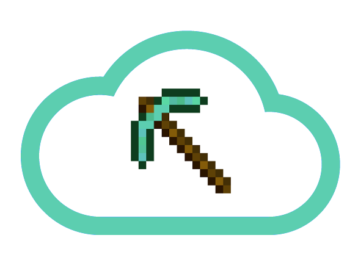

# Miner



Miner is a CLI utility to manage multiple Minecraft servers with simple commands and Docker Containers to keep them isolated.

Further more it provides the ability to backup any world to a configured S3 bucket.

Simple commands are `attach`, `create`, `start`, `stop`, `backup`.

In the works: `list`, `status`.

Also provides versions of Minecraft with `Bukkit` and pre-configured environment through created Docker Images which are tagged according to the version they provide.

Thus, it's easy to get a server, which uses mods like the ever famous `/home` teleporter
[MyHome](https://mods.curse.com/bukkit-plugins/minecraft/myhome).

# Usage

## Install

### Go Tool

In order for this to be globally available, run the following:

```bash
go get github.com/Skarlso/miner
```

### Binaries

To get the latest compiled version of Miner please, visit it's web page here and select the appropriate OS and version: [Miner](https://skarlso.github.io/miner-website).

MD5 hashes are provided for your convenience.

### Compiling

#### Glide, Godep, Dep

Because docker merged it's API into docker/docker and they depend on the Vendored version of go-connections it's not possible to build this project without a dependency management software like, [Glide](https://github.com/Masterminds/glide), [Godep](https://github.com/tools/godep) or [Dep](https://github.com/golang/dep).

A Glide config yaml is already provided. Just run `glide install --force --strip-vendor` and you should be able to build the project as expected with either `make` or `go build`.

## Description

Miner aims to be used as a lightweight server manager. It does that with Docker Containers in order to isolate running servers. The containers expose port `25655`. The words are located on the local machine though and mounted into the container via Volumes. This is so, that after a world is created, it will remain and `Plugins` or `Modules` can be used with the world. Once it starts again the modules will be enabled.

This tool also provides the option to backup a World to a configured S3 bucket. The world is zipped and uploaded using local AWS credentials located under the AWS CLI credentials file.

## Configuration Options

Miner's configuration file is located under `<USERHOME>/.config/miner/miner_config.yaml`.

There are a few options which can be set (this file is automatically created on the first run).

```yaml
bucket: my-minecraft-backup-bucket
name: miner_server
repoTag: skarlso/minecraft
bindBase: default
awsProfile: default
```

* `bucket` specifies the bucket in which the miner backs up the world
* `name` is the name of the world if no name is provided
* `bindBase` is the folder to use for the containers to bind their volume into. This is the location where your worlds will be located at. This one is important to remember, because you are going to have to interact with these worlds, as they contain the plugins and settings for any given server. This is how worlds/plugins/settings/mods are persisted for servers.
* `awsProfile` aws is configured using the AWS credential file. If you have a different profile you would like to use with `miner` than the default one, please set this.
* `repoTag` if you don't want to wait for me to push new versions up Docker, you can use your Own containers. The only requirement is that there is a `/data` folder and a `/minecraft` folder. In `/minecraft` there are three files: `forge.jar`, `craftbukkit.jar` and `minecraft_server.jar`.

## LifeCycle

So what is a typical usage cycle for `miner`?

### Setup

You begin by setting up a given version you would like to use. At this stage, both, `forge` and `craftbukkit` are an option. Run the following command to pull the required image for your server and setup the `world_name.version` file which contains information about what version the server will use. Do this by running `setup`:

```bash
miner setup new_world 1.12
```

### Start

This is where you define what mod `miner` should use to generate your world with. By default it will use `craftbukkit`. You can override this by setting the environment property `MINER_FORGE_MOD` to `1`.

In order to actually generate a world run the following:

```bash
miner start new_world
```

At this point, you have an un-altered, vanilla version of the world with default settings using craftbukkit.

#### Own World / Edit options

If you have to edit something, or have your own world you would like to use, or alter some setting, first, stop the world.

```bash
miner stop new_world
```

This saves the world and stops the container. Now, navigate to the world folder located under `<bindBase>/new_world`
and add plugins to the mod/plugin folder like [MineColonies](http://www.minecolonies.com/tutorial), or edit the server settings, or copy over a whole different world like [Coarse Sands](http://www.minecraftmaps.com/survival-maps/coarse-sands).

Once done, you can start the world again and new settings will be available to you.

### Stop

When done using the world, save and stop it by issuing the stop command again:

```bash
miner stop new_world
```

This also sends a `stop` to the Minecraft server which will save the current version of the world.

### Backup

Backup frequently if you tend to mess up everything by running the following:

```bash
miner backup new_world
```

This will zip and timestamp your world and upload to the S3 bucket defined in your settings.

### Attach

It's possible to attach to a running server if one wants to run some commands like, /op, or /give from the server.

To attach to a running world simply run:

```bash
miner attach new_world
```

Note: At this moment, sending commands doesn't work yet. But will soon-ish.

## Mods

Both, craftbukkit and forge are supported mods and come with the server pre-configured. For forge, the installed mod goes into the `mod` folder of the world for craftbukkit, it goes into the `plugin` folder. If the server is started with Forge mods, the mods need to be present on the client side as well most of the times.

Luckily, forge install is now very easy, and has a gui. You can install the client easily and just copy the ZIP file of the mod into your `mod` folder located under your minecraft install folder. For Windows it's `%appdata%\.minecraft`. For OSX this is: `/Users/user/Library/Application Support/minecraft/mods`.

To choose Forge mod, run a server like this:

```bash
MINER_FORGE_MOD=1 miner start lucky_world
```

## Versions

Versions are built by me and hosted under [MineCraft Docker](https://hub.docker.com/r/skarlso/minecraft/). I'll build more as I have the time.

As new versions will come out, I will update these containers to contain them as well.

# Contributions

They are welcomed.
